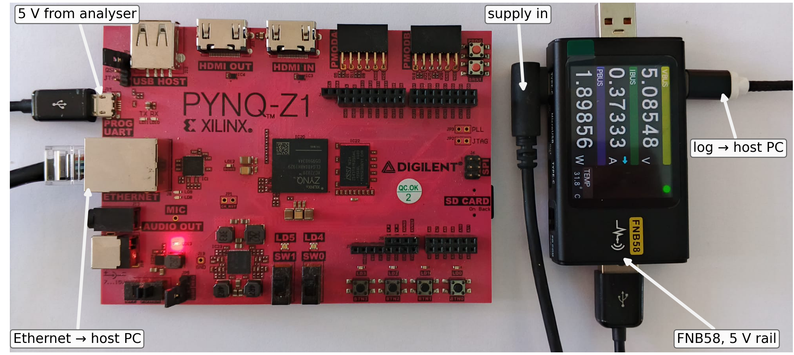

# DSP Allocation in Quantized CNN Accelerators: HLS Estimates Against Synthesized Netlists

Source, data and measurements for the IEEE Embedded Systems Letters submission by
M. Tasci and A. Akkaya, Bandirma Onyedi Eylul University.

A compact 1-D CNN for cross-load bearing-fault diagnosis is quantized to five weight
and activation configurations, carried through a pure-integer golden reference into
Vitis HLS, and implemented on a Zynq-7020 (PYNQ-Z1). Every configuration reproduces
the golden output bit-exactly on the board over the full test set.

The finding: **the DSP count reported by HLS does not describe the circuit that logic
synthesis subsequently builds.** HLS reports 59 and 55 DSP blocks for eight-bit and
four-bit weights; synthesis builds 89 and 9. The estimate errs in both directions, and
the divergence follows the weight operand alone.

---

## Configurations

Only the second convolution is swept. It holds 92% of the weights and the entire
multiplier array; the first convolution and the dense classifier keep eight-bit
weights throughout. Configuration names therefore refer to the second convolution.

| Name | conv2 weights | activations | conv2 accumulator | DSP (HLS) | DSP (built) |
|---|---|---|---|---|---|
| `W_int8_A8` | int8 | 8 bit | 23 bit | 59 | 89 |
| `W_int4_A8` | int4 | 8 bit | 19 bit | 55 | 9 |
| `A_int8_A4` | int8 | 4 bit | 19 bit | 59 | 88 |
| `A_int4_A4` | int4 | 4 bit | 15 bit | 54 | 8 |
| `W_ternary_A8` | ternary | 8 bit | 16 bit | 9 | 9 |

`W_int4_A8` and `A_int8_A4` are the controlled pair: identical accumulators, opposite
narrowed operands, and 9 against 88 DSP blocks.

---

## Flow and verification points


Correctness is checked at three points: the integer reference against the quantized
model, C simulation against the reference on 100 vectors, and the board against the
reference on all 1534 test windows.

## Measurement setup



The board is powered through a FNIRSI FNB58 analyser on the 5 V rail, logging at
10 samples/s. Three states are recorded:

| State | Meaning | Files |
|---|---|---|
| `P_A` | empty processing-system-only bitstream (the floor) | `Results/Power/A0_empty.csv` |
| `P_B` | accelerator loaded, idle | `Results/Power/B<repeat>_<config>.csv` |
| `P_C` | continuous inference | `Results/Power/C<repeat>_<config>.csv` |

Reported active power is the paired difference `P_C - P_B`, taken over three repeats
in shuffled order. `Notebooks/parse_power.py` turns the raw logs into the table in the
paper.

---

## Where each claim in the paper is evidenced

| Claim | File |
|---|---|
| Bit-exact on board, 0/1534 arg-max and 0/15340 logit | `Notebooks/02_pynq_measure.ipynb` output, `Golden/` |
| HLS reports 59 / 55 / 59 / 54 / 9 DSP | `Results/Csynth/*_csynth.rpt`, utilization summary |
| HLS binds 51 against 47 multiplications to `dsp_slice` | `Results/Csynth/*_csynth.rpt`, **Bind Op Report** section |
| Synthesis builds 89 / 9 / 88 / 8 / 9 DSP | `Results/harvest.csv` |
| Post-synthesis equals post-implementation | `Results/harvest.csv`, `synth_1` against `impl_1` rows |
| DSP budget by stage: conv1, conv2, dense | `Results/dsp_hier.csv` |
| DSP counts unchanged at 20 ns and 10 ns; ternary alone misses 10 ns | `Results/sweep_synth.csv` |
| Measured active power, three repeats | `Results/Power/`, parsed by `Notebooks/parse_power.py` |
| Timing closure of the implemented designs | `Vivado/wns.tcl`, run against the projects |
| macro-F1 over three seeds, and the clipped-float baseline | `Notebooks/01_train_and_export.ipynb`, Section 6.3 |

---

## Repository layout

```
hls-dsp-allocation/
├── Notebooks/
│   ├── 01_train_and_export.ipynb   training, golden reference, HLS artifact generation
│   ├── 02_pynq_measure.ipynb       board verification, latency, power loop
│   └── parse_power.py              reproduces the power table from the raw logs
├── HLS/
│   ├── cnn.cpp  cnn.h              single kernel source, serves all five precisions
│   ├── cnn_hw.cpp                  AXI master and AXI-Lite wrapper for deployment
│   ├── tb.cpp  tb_hw.cpp           testbenches, checked against the golden vectors
│   ├── run.tcl  hw.tcl             per-configuration synthesis and IP export
│   ├── run_all.tcl  parse_all.tcl  batch synthesis and report collection
│   ├── sweep_synth.tcl             out-of-context sweep at 20 ns and 10 ns
│   ├── W_int8_A8/                  weights.h and test_data.h for this configuration
│   ├── W_int4_A8/
│   ├── A_int8_A4/
│   ├── A_int4_A4/
│   └── W_ternary_A8/
├── Vivado/
│   ├── Bitstreams/                 .bit and .hwh for the five designs, plus empty.*
│   ├── harvest.tcl                 post-synthesis and post-implementation resources
│   └── wns.tcl                     timing summary across the projects
├── Golden/                         golden_<config>.npz: int8 inputs, classes, logits
├── Results/
│   ├── Csynth/                     HLS reports, including the Bind Op Report
│   ├── Power/                      31 raw FNB58 logs
│   ├── harvest.csv                 DSP, LUT, FF and BRAM after synthesis and implementation
│   ├── dsp_hier.csv                DSP cells attributed to conv1, conv2 and dense
│   └── sweep_synth.csv             resources and slack at 20 ns and 10 ns
├── figures/
├── CITATION.cff   LICENSE   README.md
└── environment.txt   requirements.txt
```

`empty.bit` in `Vivado/Bitstreams/` is the processing-system-only design used as the
power floor. It is not an accelerator.

---

## Reproducing

### 1. Train and export

Run `Notebooks/01_train_and_export.ipynb`. It downloads the CWRU drive-end set,
builds the leave-one-load-out split, trains the float model once, folds batch
normalization, fine-tunes each configuration, derives the pure-integer reference,
verifies it against the quantized model, and writes `weights.h`, `test_data.h` and
`golden_<config>.npz`.

Set `ROOT` in the first code cell to your working folder. About 25 minutes on a
Colab T4.

### 2. Synthesize

The kernel sources are shared across configurations; only the two headers differ.
Copy the shared files into a configuration folder before running:

```bash
cd HLS
cp cnn.cpp cnn.h cnn_hw.cpp tb.cpp tb_hw.cpp run.tcl hw.tcl W_int8_A8/
cd W_int8_A8
vitis_hls -f run.tcl -tclargs 1      # C simulation and C synthesis
vitis_hls -f hw.tcl  -tclargs 1      # AXI-wrapped IP for deployment
```

For all five at once, from `HLS/`:

```bash
vitis_hls -f run_all.tcl             # csim and csynth, every configuration
vitis_hls -f parse_all.tcl           # collect the reports into results.csv
vitis_hls -f sweep_synth.tcl         # out-of-context sweep at 20 ns and 10 ns
```

### 3. Implement

Vivado 2024.1, part `xc7z020clg400-1`. Add `<config>/hw_U1/sol1/impl/ip` as an IP
repository, instantiate `cnn_hw` with a ZYNQ7 processing system (`S_AXI_HP0` enabled,
`FCLK_CLK0` at 50 MHz), create the HDL wrapper and generate the bitstream. Then:

```bash
vivado -mode batch -source Vivado/harvest.tcl    # resources and DSP breakdown
vivado -mode batch -source Vivado/wns.tcl        # timing summary
```

Prebuilt bitstreams are in `Vivado/Bitstreams/` if you only want to reproduce the
board results.

### 4. Measure on the board

Copy `<config>.bit`, `<config>.hwh` and `golden_<config>.npz` to the PYNQ-Z1 and run
`Notebooks/02_pynq_measure.ipynb`. It verifies bit-exactness against the golden
reference, times a single window and a streamed batch, and runs a continuous loop for
the power measurement window.

### 5. Reproduce the power table

```bash
python Notebooks/parse_power.py --dir Results/Power
```

Prints the floor, the per-configuration `P_B`, `P_C`, `P_B - P_A` and `P_act`, the
within-window uncertainty, and the Welch statistics for the ternary comparison.

---

## Environment

| Component | Version |
|---|---|
| Vitis HLS | 2024.1 |
| Vivado | 2024.1 |
| Target | `xc7z020clg400-1`, 50 MHz fabric clock |
| Board | Digilent PYNQ-Z1, PynqLinux based on Ubuntu 18.04, Python 3.6.5 |
| Training | Python 3.13.15, TensorFlow 2.20.0 |
| Power analyser | FNIRSI FNB58, 10 samples/s, 5 V rail |

Full manifest in `environment.txt`, Python packages in `requirements.txt`. Seeds are
42, 1 and 7; the float model is trained once and reloaded for every configuration, so
all results share an initialization.

## Not included

- **CWRU raw data.** Not redistributed. `01_train_and_export.ipynb` downloads it from
  the `srigas/CWRU_Bearing_NumPy` mirror; the original source is the Case Western
  Reserve University Bearing Data Center.
- **Vivado and Vitis HLS project directories.** Only generated sources, scripts,
  reports, bitstreams and `.hwh` files are kept.

## License

Code and scripts: MIT, see `LICENSE`. The CWRU dataset is subject to its own terms.

## Citation

See `CITATION.cff`, or cite the paper once it appears.
