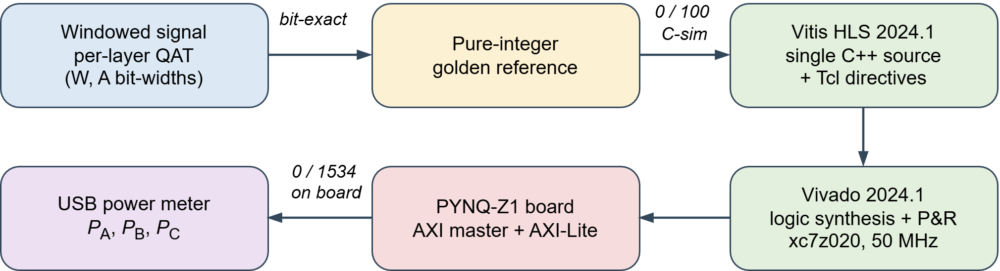

# DSP Allocation in Quantized CNN Accelerators: HLS Estimates Against Synthesized Netlists

Source, data and measurements for the IEEE Embedded Systems Letters submission by
M. Taşcı and A. Akkaya (Bandırma Onyedi Eylül University).

A compact 1-D CNN for cross-load bearing-fault diagnosis is quantized to five weight
and activation configurations, carried through a pure-integer golden reference into
Vitis HLS, and implemented on a Zynq-7020 (PYNQ-Z1). Every configuration reproduces
the golden output bit-exactly on the board over the full test set.

The finding: **the DSP count reported by HLS does not describe the circuit that logic
synthesis subsequently builds.** HLS reports 59 and 55 DSP blocks for eight-bit and
four-bit weights; synthesis builds 89 and 9. The estimate errs in both directions, and
the divergence follows the weight operand alone.

---

## Flow and verification points



Correctness is checked at three points: the integer reference against the quantized
model, C simulation against the reference on 100 vectors, and the board against the
reference on all 1534 test windows.

## Measurement setup


The board is powered through a FNIRSI FNB58 analyser on the 5 V rail, logging at
10 samples/s. Three states are recorded and reported as paired differences:

| State | Meaning |
|---|---|
| `P_A` | empty processing-system-only bitstream (floor) |
| `P_B` | accelerator loaded, idle |
| `P_C` | continuous inference |

`P_act = P_C - P_B`, repeated three times per configuration in shuffled order.

---

## Configurations

| Name | Weights | Activations | conv2 accumulator | DSP (HLS) | DSP (built) |
|---|---|---|---|---|---|
| `W8A8` | int8 | 8 bit | 23 bit | 59 | 89 |
| `W4A8` | int4 | 8 bit | 19 bit | 55 | 9 |
| `W8A4` | int8 | 4 bit | 19 bit | 59 | 88 |
| `W4A4` | int4 | 4 bit | 15 bit | 54 | 8 |
| `TerA8` | ternary | 8 bit | 16 bit | 9 | 9 |

---

## Where each claim in the paper is evidenced

| Claim | File |
|---|---|
| Bit-exact on board, 0/1534 arg-max and 0/15340 logit | `notebooks/02_pynq_measure.ipynb` output, `golden/` |
| HLS reports 59 / 55 / 59 / 54 / 9 DSP | `results/csynth/*_csynth.rpt`, summary table |
| HLS binds 51 vs 47 multiplications to `dsp_slice` | `results/csynth/*_csynth.rpt`, **Bind Op Report** section |
| Synthesis builds 89 / 9 / 88 / 8 / 9 DSP | `results/harvest.csv` |
| Post-synthesis equals post-implementation | `results/harvest.csv` (`synth_1` vs `impl_1` rows) |
| DSP budget by stage (conv1 / conv2 / dense) | `results/dsp_hier.csv` |
| DSP counts unchanged at 20 ns and 10 ns; ternary fails at 10 ns | `results/sweep_synth.csv` |
| Measured active power, three repeats | `results/power/`, parsed by `results/parse_power.py` |
| macro-F1 over three seeds, and the clipped-float baseline | `results/accuracy_master.csv` |
| Latency and throughput | `notebooks/02_pynq_measure.ipynb` output |

---

## Reproducing from scratch

**1. Train and export** — `notebooks/01_train_and_export.ipynb` (Colab or local)

Downloads the CWRU drive-end set, builds the leave-one-load-out split, trains the
float model once, folds batch normalization, runs quantization-aware fine-tuning for
each configuration, derives the pure-integer reference, verifies it against the
quantized model, and emits `weights.h`, `test_data.h` and `golden_<config>.npz`.

**2. Synthesize** — from `hls/`

```
vitis_hls -f run_all.tcl      # csim + csynth, all configs
vitis_hls -f parse_all.tcl    # collect reports into results.csv
```

Per configuration, `hw.tcl` builds the AXI-wrapped IP:

```
cd hls/W8A8 && vitis_hls -f hw.tcl -tclargs 1
```

**3. Implement** — Vivado 2024.1, part `xc7z020clg400-1`

Add `hls/<config>/hw_U1/sol1/impl/ip` as an IP repository, instantiate `cnn_hw` with
a ZYNQ7 PS (`S_AXI_HP0` enabled, `FCLK_CLK0` = 50 MHz), create the HDL wrapper and
generate the bitstream. Then:

```
vivado -mode batch -source vivado/harvest.tcl    # post-synth/impl resources + DSP breakdown
vivado -mode batch -source hls/sweep_synth.tcl   # 50 / 100 MHz out-of-context sweep
```

**4. Measure** — copy `<config>.bit`, `<config>.hwh` and `golden_<config>.npz` to the
PYNQ-Z1 and run `notebooks/02_pynq_measure.ipynb`. It verifies bit-exactness, times a
single window and a streamed batch, and runs a continuous loop for the power window.

---

## Environment

| Component | Version |
|---|---|
| Vitis HLS | 2024.1 |
| Vivado | 2024.1 |
| Target | `xc7z020clg400-1`, 50 MHz fabric clock |
| Board | Digilent PYNQ-Z1, PYNQ framework |
| TensorFlow / Keras | see `environment.txt` |
| Power analyser | FNIRSI FNB58, 10 samples/s, 5 V rail |

Seeds are 42, 1 and 7; the float model is trained once and reloaded for every
configuration, so all results share an initialization. Operation-level determinism is
enabled in TensorFlow.

## Not included

- **CWRU raw data.** Not redistributed. `01_train_and_export.ipynb` downloads it from
  the `srigas/CWRU_Bearing_NumPy` mirror; the original source is the Case Western
  Reserve University Bearing Data Center.
- **Vivado and Vitis HLS project directories.** Only the generated sources, scripts,
  reports, bitstreams and `.hwh` files are kept.

## License

Code and scripts: see `LICENSE`. The CWRU dataset is subject to its own terms.

## Citation

See `CITATION.cff`, or cite the paper once it appears.
